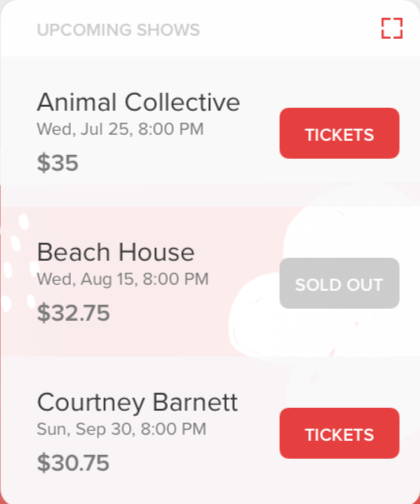

# Design Patterns
>Unity doesn't allow you to create custom components in code. You have to create them in the UI, and then customize/initalize those objects from code. Those customizeable objects are called prefabs. There is a certain process when a target is found, how it creates the UI and what the User Interface should look like. 

# Platform/App Design
>This is the overall design of how the app works, and interacts with Vuforia to create the UI. 
The AR Reader App is designed so that when it detects an Image Target (Image for the phone to detect) it displays a User Interface that the user can interact with. Since we're using Unity it's not as easy as it sounds. 

#### Platform Workings Overview
1. **Vuforia is initalized (on default when app starts)**
2. **App is looking for Image Targets in database** 
3. **Image Target is detected** 
    - When the Image Target is detected in Unity, a couple pieces of information are automatically transferred from Vuforia's database. You get the rating of how good of an Image Target is able to be detected, the image target name, if the target is active, date modified, and most importantly metadata.
4. **Parses metadata from Image Target** 
    - (usually in JSON form, doesn't *have* to be) to understand what object should be created, where it should be postiioned, how interactable it is, and how many image targets you would like.
5. **Instantiates the specified objects with their prefabs**

## Prefabs
You must use them extensively throughout the entire process and these are how you get to several objects the user can choose to put overlay their user content.

The list object is an example of a prefab. A prefab is a prefabricated object created in the UI, that you can reference in code. The prefab in this case is the UI, with a preset view with various list elements. You can set the text, colors, font, once you instantiate it into the view.  Here's an example: *be sure to have the prefab in the resources folder*    
`GameObject object = (GameObject)Instantiate(Resources.Load("List"));`    
^ The above code would create a new GameObject with the List prefab.  

## Image Target UI Creation
> There are a couple of ways to create Image Targets and the nice part about the Vuforia API, is it will most likely work with any tech stack you pick. 

If you are testing and getting acquainted with Vuforia, make sure you go through creating an image target before you create it in code. This is because it gives you a better idea of how the process works, everything you need, and how the whole process goes down. [Creating an Image Target online through Vuforia](https://developer.vuforia.com/targetmanager/project/deviceTargetListing).  
**You have to make sure you know the width of your target you're uploading.** This is *very* important for the app to be able to recognize the target and size/position everything correctly.  **The size is *always* in meters when working in Augmented Reality.** Even if you're in the Unity Editor or somewhere else, it will always defaultly be measured in meters. It's a standard for sizing.

If you would like metadata on the Image Target you have to upload metadata as a `.txt`, you can parse purely as just a string, or in JSON format through the app.

#### Creating an Image Target through code
>**This will require a machine with Python 3 installed.**
There is a python backend that was created to interact with Vuforia's Web Services API *only* for CloudRecos. It contains a lot of other features, but they're not as important as being able to create/update Image Targets in the database. (Which is what I bulit out, and used it for)