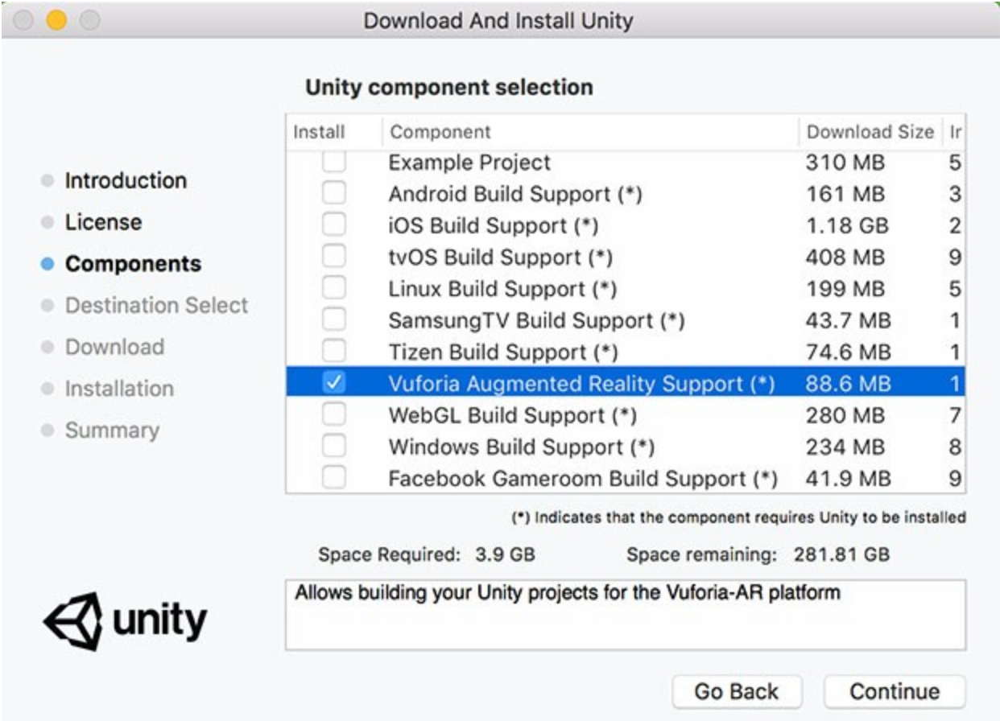

# Developer Machine Setup
> Outlines the steps required to get the AR Demo project running on a developer machine. Also includes any troubleshooting items that may have been encountered.

Table of Contents
=================
* [Windows Setup](#windows-setup)
* [Mac Setup](#mac-setup)
* [Setup](#)
* [Troubleshooting](#troubleshooting)

## Mac Setup
> The Mac setup is used if you **need to build** and test for iOS. You can also install and use it for Android if it is your preferred platform to work on.
1. Go to the Mac App Store or [Apple Developer's Website](https://developer.apple.com/xcode/).
    - Download Xcode (it includes to required toolset to run Unity iOS builds)
2. Continue onto [Normal Setup](#setup)

# Setup
> These steps are not specific to any machine, you will have to do this on Mac or Windows and is the same process. 

1. Before you install Unity, make sure you have [Visual Studio Community](https://visualstudio.microsoft.com/downloads/) installed. Visual Studio is much nicer to work in and allows you to have auto-completion and class documentation that is not available when you use VSCode for Unity. 
2. Download the most recent version of [Unity](https://store.unity.com/download?ref=personal).
    - Choose the free "personal" version of Unity. (We don't have a professional plan yet)
3. When going through the Unity installation process, and the prompt comes up for you to choose Component Installation **be sure** to check ["Vuforia Augmented Reality Support"](https://library.vuforia.com/articles/Training/getting-started-with-vuforia-in-unity.html). _If you are building for iOS/Android, you **also** need to check those boxes as well. 

4. Once it finishes installing, and the project finder starts in Unity. Create a Unity Account with your Andculture email address.
5. You need to request permission from [Von Bock](vb1191@messiah.edu) to have access to the Advertising Demo project on Unity. 
6. Once you open the project, you want to correctly set which platform you are building for, go to File > Build Settings... &nbsp;&nbsp;&nbsp;&nbsp;**Default is PC, Mac, and Linux Standalone**
 
7. Click the Switch Platform button for your desired development platform. *iOS requires a Mac with Xcode tools installed.*

## Troubleshooting
> Includes common troubleshooting steps that can be taken when issues are encountered.

**Issue**: _Misisng Vuforia License Key, Incorrect License Key, Invalid License Key_

**Solution**: Go to [Vuforia's Dev Portal](https://developer.vuforia.com/targetmanager/licenseManager/licenseListing), and click on the MagazineADDemo Cloud. Then select the Database Access Keys. *On this page:* You will almost always use the Client Access Keys. The only time you wouldn't is if you are interacting with the Vuforia Web Services REST API.  