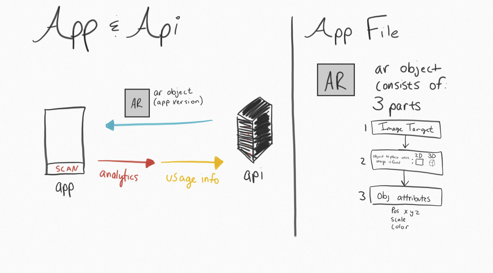
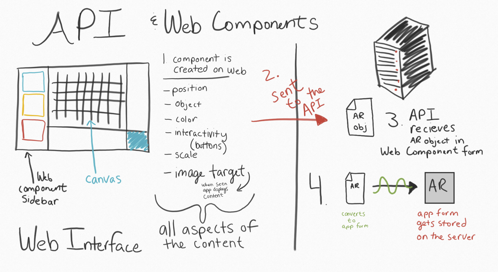

# Summary 
>Describes all of the nuances and details of the project that are different from normal development standards. Anything that could be confusing or save the other person a lot of time. This also goes over everything about the project and how it might be completed, and why it has been created the way it has. 

There's two portions of this project the app (primarily which I focused on) and the web portion (which I flushed out to the best of my ability to make easy for someone else to come in and start working on it).  
Here's an overview of the Web Portion and all the pieces involved with that. 

Progress: Currently I didn't touch anything with the front end. But I did create multiple models to be used throughout the web platform, and how the information would be transmitted to the app via an API. I created those objects and a low-fidelity CRUD server to pass information like this over to the app locally.   `python-code/CRUD API/ardemo.py`
I started creating an API Webpage for this to load all the information in creating objects server-side and what that might look like. If you run the python-flask server locally on your machine and you go to the normal localhost path, the API website wiil be served to you in your browswer. 

#Unity 
>Unity is a very different development environment that takes awhile to get used to. There are certain ways everything has to be done in order for it to work. Heads-Up -- In Unity you have to connect script files to the User Interface in the Scene you are working in. You *CANNOT* do everything in code. But in this document I will show you how to re-create the UI Manipulations in code, and how to get away with doing the bare-minimum in Unity's User Interface.